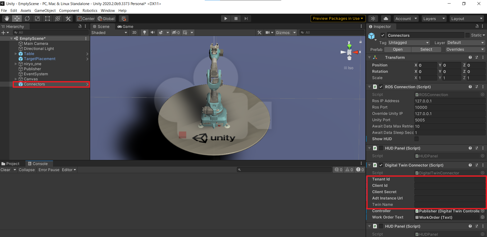

# Niryo robot digital twin

Highly based on the repository [Unity-Robotics-Hub](https://github.com/Unity-Technologies/Unity-Robotics-Hub/tree/dev/tutorials/pick_and_place)

## ROS 

Build the docker image with 
```
cd ROS
docker build -t unity-robotics:pick-and-place -f Dockerfile .
```

Run the ROS with 
```
docker run -it --rm -p 10000:10000 -p 5005:5005 unity-robotics:pick-and-place
```

the ROS purpose is to transmit to the modeled robot a trajectory to be followed in order to go from a point A to a point B.

## Simulator

### IoT Device

A really basic simulator. Based on Nodejs.
It connects to Azure Iot Hub using a device connection string that must be provided with the environment variable DEVICE_CONNECTION_STRING

Run the simulator with 
```
cd simulator
npm install
npm start
```

To change the values, you have to use the [IoT Device direct methods](https://docs.microsoft.com/en-us/azure/iot-hub/iot-hub-devguide-direct-methods)

- turnOn
- turnOff
- openGripper
- closeGripper
- setPosition with parameters 
  - Position (all between -1 and 1)
    - x
    - y
    - z

### IoT Edge + OPC UA

Simulator based on the OPCUA protocol and Azure IoT Edge.

The OPCUA simulator can be used in docker with commands
```
docker build -t opcua-simulator -f Dockerfile .
docker run -it -d --network="host" --name=simulator opcua-simulator
```

Or you can just use 
```
npm install
npm start 
```

For the IoTEdge, you can use the deployment template in the folder OPCUA/iotedge
It use the modules in the folder ../IotEdgeModules

Put the file pn.json in a folder /iiotedge in your iot edge device (used for the OPCPublisher module)

# Digital twin

We do not provide here the code to connect your IoTHub to an Azure Digital Twin.

The simplest way is to use an Azure function to redirect all the IoTHub messages to your digital twin models.

The robot Definition Model is in the folder "TwinModel"

# Unity

Install [Unity](https://unity3d.com/get-unity/download) version 2020.2.0b9 and open the project in the folder "Unity". 

In the folder "scene", open "Twin"

In the Unity hierarchy, you can see an object "Connector".

You must fill the parameters to allow connection to your Digital Twins instance:
- Tenant Id
- Client Id
- Client Secret 
- Adt Instance URL
- Twin name

<p align="center"></p>

When you run the project, it should connect to Azure Digital Twins and retrieve the desired twin every 5 seconds. If any change is reported, it will change the robot state.
